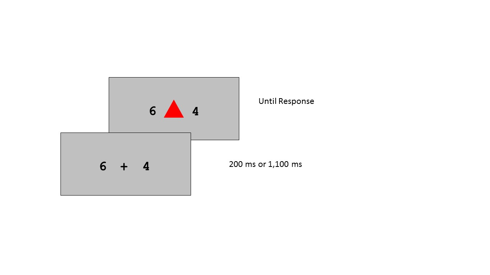

*(modified title)*

The intent for this document is to provide a brief overview of the theory and methods of the present paper -- we're only covering the information a reader would need to know in order to understand the context of the analyses. Interested readers are encouraged to read the full document ([Braun & Arrington, 2018](../other_resources/Braun & Arrington, 2018.pdf)). 

## Theoretical Background

On any given Saturday, the average person is faced with a paralyzing dilemma: Stay at home and watch one's favorite television programs, or run errands and be a generally productive member of society. We humans have a great deal of processing power that sits idly in our brains at any moment, and we are constantly confronted with choices about how to best spend this (limited) power. Being too frugal with effort will likely prevent one from reaching one's goals. But indiscriminately applying effort isn't a good strategy either -- a person who wakes up and solely works on long division problems for twelve hours a day is unlikely to achieve any type of meaningful success in life. Effort investment needs direction, and expenditure of effort is perhaps most profitable when guided by one's goals. Thus we can think about the decision to spend effort as a maximization problem: I desire to choose the action that maximizes the reward that I will receive from that action (i.e., the extent to which it satisfies some goal that I have) while minimizing the effort investment needed to complete the action. Thinking about decisions as a function of reward minus effort is a trend that has gained recent popularity in the literature ([Shenhav, Botvinick & Cohen, 2013](https://doi.org/10.1016/j.neuron.2013.07.007)) and it is one that will allow us to explore a couple of aims in the present study.

### Aim 1 -- The Representation of Reward

How are people representing the reward that is associated with a given action (or task, as we will be referring to it)? In the present study, participants switch between performing two different, simple tasks. We draw on the literature on processes surrounding task switching to suggest that people might have a stronger representation of the reward for the task that they just performed (for a full discussion, see Braun & Arrington, 2018). In other words, if I just performed task A, the reward that I stand to gain from performing task A again might be more salient to me than the reward I stand to gain from task B. We introduced a paradigm that investigated whether, when all else is equal, are people more sensitive to changes in the reward of the task that was just performed?

### Aim 2 -- The Representation of Effort

One challenge involved in tackling the intersection between reward and effort is that these two things are on completely different scales. As long as one's goals are sufficiently constrained in a particular environment, reward can be quantified easily enough. For example, in the present study, we tell participants that their goal is to earn a set number of points throughout the experiment. This allows us to control reward by manipulating how many points participants get for a given response. Effort, on the other hand, is much more difficult to pin down. Predicting how effortful an action will be requires having some abstract representation of effort for that action in one's brain. How can this be reduced to a number or something that we can quantify? The question of how effort is represented in the brain is an old one ([Hull, 1943](http://psycnet.apa.org/record/1944-00022-000)) and is still a hotly debated one ([Shenhav et al., 2017](http://www.wouterkool.com/pdfs/ShenhavEtAl_ARN_2017.pdf)). One central aim of the present study is to introduce a novel paradigm that strives to make effort quantifiable. We also sought to test a prediction from the literature on motivated allocation of effort, that the cost of effort increases as more effort is expended ([Kool & Botvinick, 2014](http://www.wouterkool.com/pdfs/KoolBotvinick_JEPG_2014.pdf)). In other words, given an action that demands a certain level of effort, that action will be subjectively more effortful if the actor is already fatigued than if the actor was just at rest. 

## Method Overview

Participants came into our laboratory and completed a simple, computer-based task for about an hour. They made repeated key-press responses to stimuli that appeared on the screen (each response is called a "trial"), and trials were grouped into blocks. In each block, participants needed to accrue 500 points as quickly as possible; once this threshold was reached, the block terminated and the amount of time that it took the participant to complete the block was displayed on the screen. 

On each trial, participants saw the stimuli depicted below in Figure 1. A colored shape was presented, and participants had the choice of performing one of two possible perceptual tasks on the presented stimulus. They could respond by judging the stimulus' shape (circle or triangle) or its color (blue or red). When performed accurately, participants received the number of points associated with the performed task. The digits presented to the left and right of the stimulus reflected the reward the participant would receive on that trial for performing the task mapped to left or right hand (respectively). For example, if I saw the digit "6" presented to the left of the stimulus, and the responses for the shape task were mapped to my left hand, I know that if I correctly judged the shape of the presented stimulus, I would receive six points for that response.

At this point it may seem as though the best strategy would be to always just pick the task with the highest reward. But we actually manipulated rewards against effort in this context to make the decision of which task to choose more interesting. In these types of task-switching paradigms, it's well known that it's more effortful and takes longer to switch between tasks from one trial to the next rather than simply repeating tasks ([Arrington & Logan, 2004](http://journals.sagepub.com/doi/abs/10.1111/j.0956-7976.2004.00728.x)). If I performed the shape task on the last trial, it will require more time and effort for me to now perform the color task relative to if I were to just keep doing the shape task. We manipulated how the points change from trial to trial in order to juxtapose this switch cost. In other words, the reward for a task diminished as that task was repeated more and, conversely, the reward for the non-performed task increased. The reward change is probabilistic such that, on the ensuing trial, the reward for the task that was just performed (what we refer to as the "current" task) either decreased by one or remained constant (at a probability of .5). The reward for the non-performed task (what we refer to as the "other" task) either *increased* by one or remained constant (at an independent probability of .5). The points for the two tasks were bounded between 0 and 10. In sum, the environment was set up to generally make the more effortful choice more rewarding. 

### Variable Coding

The following is a list of the important variables that we looked at in the analysis and a brief description of what they mean:

  * subject -- subject ID 
  * block -- position in the experiment (out of 12)
  * blocktime -- amount of time it took to complete a given block
  * trial -- each row in the dataset represents one trial
  * current -- factor var representing whether the value of the task performed on previous trial changed (1 = decrease by a point, 0 = remained constant)
  * other -- same as current (above) except represents value changes for task not performed on previous trial and (1 = increase by a point, 0 = remain constant)
  * difference -- difference between values on present trial (other - current; integer var with range -10 through 10). Positive values indicate more reward for switching.
  * rt -- amount of time between stimulus onset and response on present trial
  * transcode -- task selection at trial N relative to selection at trial N-1 (1 = switched to the opposite task, 0 = repeated same task)
  
### Empirical Hypotheses

* Participants will be more sensitive to changes in the current task reward than to changes in the other task reward. In contexts where only one task reward has changed (while the other remained constant), we predicted that participants will switch more often in response to decreases in the current task's reward than to increases in the other task's reward.

* We predicted that the cost of effort will be offset by reward. As long as the reward for switching is greater than that for repeating, the likelihood of switching tasks should be a linear function of the extent to which the reward for switching is greater than that of repeating. For example, participants should be more likely to switch tasks when they stand to get three extra points for doing so relative to only one extra point. 

* The cost of effort will increase as more effort is expended. Participants should require more reward to offset the same effort cost in later relative to earlier blocks of the experiment. 
  
  
  
  
  
  
  
  
  
  