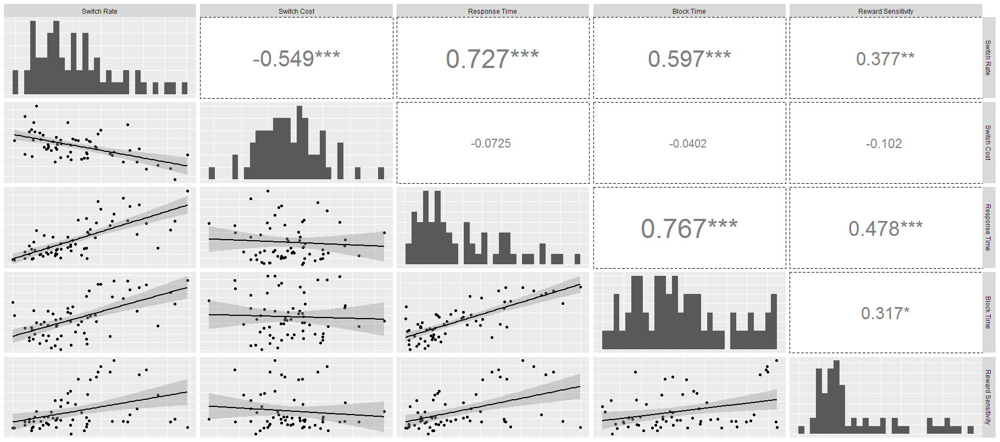

The first thing we tackled in the results section was looking at individual differences in various performance measures in the rVTS paradigm. Because we were introducing a novel paradigm, we felt it was important to show some of these basic descriptives so readers could get a broader sense of behavior in this context. 

I'm going to try my best to reproduce what I found originally when running these analyses for the paper. I'll include the original R script that I used to produce the final figure (Figure 2 in the paper) in this repo, but for now I'll try to reconstruct what I did without spending the time necessary to get into every single detail. 

One of the R skills I've learned since doing the original analyses is dplyr for data wrangling, so I'm going to try to use that style where I can. At times I fall back to using data.table, however. Dplyr of course has the advantage that it has a more reader-friendly syntax, so I recognize the importance of using it more, especially for purposes like this where I'm trying to showcase an analysis.


### Load libraries and data

```{r}
library(data.table)
library(plyr)
library(dplyr)
library(GGally)
library(tidyr)
library(ggplot2)

```

```{r}
# can't get the colClasses argument to change vars to numeric for some reason
current_data <- fread('../data/easy_clean.csv')

```

### Trimming RT outliers

I used a pretty nasty line of data.table to get this to work, but I think it's pretty incredible that it's possible to trim RTs on a subject-wise basis all in one line (sacrificing readability, of course). 

One weird quirk that we encountered during this analysis is that, because we included block times as a measure, and block times are obviously summarized at a block level, we thought it important to summarize the rest of the individual difference measures on a block level first (for consistency). That put me in a tricky situation when trying to get the standard deviation around the average RTs for subjects. My approach was to first get the standard deviation for RTs for each subject in each block, then take the average of that standard deviation across blocks for each subject. I doubt it makes much difference, as we're only talking about 6% of the data. 

```{r}
# trim trials that have RTs more extreme than 2 sds beyond a subject's mean RT
# in the paper I summarized this over block first.. 
original_rows <- nrow(current_data)
current_data <- current_data[, c('rt_m', 'rt_sd') := .(mean(rt), sd(rt)), by = .(subject, block)][, c('rt_m', 'rt_sd') := .(mean(rt_m), mean(rt_sd)), by = subject][rt <= 2 * rt_sd + rt_m][, c('rt_m','rt_sd') := NULL]
paste('Removing RT outlier trials dropped ', round(1 - nrow(current_data) / original_rows, 2) * 100, '% of the data.', sep = '')

```

### Summarizing variables

Like I indicated above, we summarized everything across blocks first, and then across subjects. In this paradigm, blocks were not made up of a constant number of trials, but rather block length was a function of the subject's performance. This means that (for block time) blocks with longer block times would also have more observations, and this would skew the mean by placing more weight on these longer blocks. To compensate for this we summarized everything across blocks first. It made for a more tedious summarization procedure, but I think it's ultimately good practice. 

Below is my code for summarizing blocktime, RT, switch rate, and switch cost, all done with dplyr.

```{r}

## summarizing block times across blocks first so all blocks are weighted equally
subject_level <- current_data %>%
  group_by(subject, block) %>%
  summarize(blocktime = mean(blocktime),
            rt = mean(rt),
            switch = mean(transcode)) %>%
  group_by(subject) %>%
  summarize(blocktime = mean(blocktime),
            rt = mean(rt),
            switch = mean(switch))


## computing reward sensitivity and switch cost separately and joining them back in

subject_level <- current_data %>%
  group_by(subject, block, transcode) %>%
  summarize(rt = mean(rt)) %>%
  group_by(subject, transcode) %>%
  summarize(rt = mean(rt)) %>%
  spread(transcode, rt) %>%
  mutate(switch_cost = `1` - `0`) %>%
  select(-`0`, -`1`) %>%
  inner_join(subject_level)

```

The code below summarized a variable that we referred to as reward sensitivity. We essentially wanted a measure of how responsive subjects were to the reward environment. There were a number of ways we could've done this, but our approach was to subtract subjects' average switch rate when the reward for both tasks remained constant between trials (the condition where we'd expect subjects to repeat) from the average switch rate when the reward for both tasks changed (the condition where we'd expect subjects to switch). We assume that the greater this difference is, the more sensitive that particular subject is to changes in the reward environment. Our future research looks at more nuanced ways to capture this same concept. 

I resorted to data.table for this one. I couldn't quite get dplyr to do what I wanted.

```{r}

## I had an easier time doing this one with data table for some reason
reward_sensitivity <- current_data[(current == 0 & other == 0) | (current == 1 & other == 1), .(switch = mean(transcode)), by = .(subject, block, (current == 0 & other == 0))]
reward_sensitivity <- spread(current, switch, data = reward_sensitivity)
colnames(reward_sensitivity)[3:4] <- c('high','low')
reward_sensitivity[, c('reward_sensitivity') := c(high - low)][, c('high', 'low') := NULL]
subject_level <- inner_join(subject_level, reward_sensitivity[, .(reward_sensitivity = mean(reward_sensitivity)), by = subject])

write.csv(subject_level, '../data/subject_data.csv', row.names = F)

```

### Plot the individual differences

I used the GGally::ggpairs function to plot these individual differences, and I love this method because you get (a) the correlation coefficient, (b) the bivariate scatterplot and (c) the histogram of the distribution, all in one shot. I also used a nifty mod to this function (from [here](https://github.com/tonytonov/ggally/blob/master/R/gg-plots.r)) to get the font size of the correlation coefficient to be proportional to the actual strength of the correlation (although I used a constant font size in our publication). 

```{r, eval=FALSE, message=TRUE, warning=TRUE, include=FALSE}
    ggpairs(subject_level, 
            columns = c('switch','switch_cost','rt','blocktime','reward_sensitivity'),
            columnLabels = c('Switch Rate','Switch Cost','Response Time','Block Time', 'Reward Sensitivity'),
            diag = list(continuous = 'bar'),
            lower = list(continuous = 'smooth'),
            axisLabels = 'none') 
```

The graph didn't display well when running the code in the notebook, but here's an image of the graph that was rendered in R output:



I apologize for the small labels -- the ggpairs function is wonderful but sometimes modifying the options can be a headache. From left to right, the labels read:
Switch Rate, Switch Cost, Response Time, Block Time, Reward Sensitivity

If you cross reference with what I reported in the paper, you'll see I didn't reproduce the numbers perfectly. But overall I'm pretty happy with the fact that the strength, direction and significance of the relationships are largely the same. There are a few exceptions (like the relationship between RT and Block Time to Switch Cost), but it might be a massive time investment to figure out what exactly is going on. Either way, the strengths of the relationships are weak.

In the text, we largely left the interpretation of this figure up to the reader, and I'm inclined to do the same here. Maybe just a few comments:  

*  The negative correlation between switch rate and switch cost is a nice replication of what's typically found in the literature. The more you switch, the less cost you incur for doing so.
*  We're chiefly concerned with factors that might influence block time (i.e., performance efficiency):
  *  Block time is positively associated with everything *except* switch cost
  
It's hard to know what to make of the relationship between block time and reward sensitivity. One might think that individuals who are more sensitive to changes in the reward environment might complete the task more efficiently -- but again we might be limited because we're dealing with an admittedly imperfect measure of reward sensitivity. Our future research more explicitly investigates factors that influence performance efficiency.


